  <picture>
    <source media="(prefers-reduced-motion: reduce) and (prefers-color-scheme: dark) and (max-width: 600px)" srcset="assets/readme/hero-dark-mobile-static.svg">
    <source media="(prefers-reduced-motion: reduce) and (max-width: 600px)" srcset="assets/readme/hero-light-mobile-static.svg">
    <source media="(prefers-reduced-motion: reduce) and (prefers-color-scheme: dark)" srcset="assets/readme/hero-dark-static.svg">
    <source media="(prefers-reduced-motion: reduce)" srcset="assets/readme/hero-light-static.svg">
    <source media="(prefers-color-scheme: dark) and (max-width: 600px)" srcset="assets/readme/hero-dark-mobile.svg">
    <source media="(max-width: 600px)" srcset="assets/readme/hero-light-mobile.svg">
    <source media="(prefers-color-scheme: dark)" srcset="assets/readme/hero-dark.svg">
    
  </picture>

<samp>
  <a href="https://maxma615.github.io/maxma615/">首页</a>
  &nbsp;·&nbsp;
  <a href="#精选项目">精选项目</a>
  &nbsp;·&nbsp;
  <a href="#经历与荣誉">经历与荣誉</a>
  &nbsp;·&nbsp;
  <a href="https://github.com/maxma615?tab=repositories">仓库</a>
</samp>

  我是马超，2022 年进入杭州电子科技大学学习智能科学与技术。 
  2025 年在地瓜机器人 D-Robotics 开发者生态部实习，做机器人应用开发。 
  我喜欢把视觉模型跑在板子上，再接到真实的机器人里。

经历截至 2025.09

## 精选项目

<table>
  <tr>
    <td width="50%" valign="top">
      <h3>赛道视觉分析</h3>
      
个人项目 · racing_vision_ai

      
用 ROS 2 信号触发图像采集，调用视觉语言模型分析赛道事件。

      
<code>ROS 2</code> <code>Python</code> <code>VLM</code>

      <a href="https://github.com/maxma615/racing_vision_ai">项目源码 ↗</a>
    </td>
    <td width="50%" valign="top">
      <h3>LeRobot 机械臂</h3>
      
协作项目 · D-Robotics fork

      
协助完成 RDK S100 的 ACT 叠衣服演示，整理 BPU 部署工具与文档。

      
<code>RDK</code> <code>ACT</code> <code>BPU</code>

      <a href="https://github.com/maxma615/rdk_LeRobot_tools">工具与文档 ↗</a>
    </td>
  </tr>
  <tr>
    <td width="50%" valign="top">
      <h3>S100 Model Zoo</h3>
      
上游项目 · 模型部署

      
参与分类与跟踪模型上库，编写量化示例和精度验证脚本。

      
<code>CV</code> <code>BPU</code> <code>Python</code>

      <a href="https://github.com/D-Robotics/rdk_model_zoo_s">上游项目 ↗</a>
    </td>
    <td width="50%" valign="top">
      <h3>RDK 节点文档</h3>
      
开发者文档 · 使用指南

      
为视觉和语音节点整理安装、部署与使用指南，帮助开发者上手。

      
<code>ROS 2</code> <code>RDK</code> <code>Docs</code>

      <a href="https://github.com/maxma615/nodehub_YOLO">YOLO</a> ·
      <a href="https://github.com/maxma615/nodehub_asr">ASR</a> ·
      <a href="https://github.com/maxma615/nodehub_tts">TTS</a>
    </td>
  </tr>
</table>

## 经历与荣誉

<strong>实习与工程实践 · 2025</strong>

- **LeRobot / ACT 机械臂**：协助完成 RDK S100 上的 ACT 叠衣服演示与全流程文档；在 ROS 暑期学校支持 ACT 量化部署和 ONNX / HBM 推理精度验证。
- **RDK S100 Model Zoo**：参与 MobileNet、ResNet、EfficientNet-Lite 和 ByteTrack 的上库工作，编写量化部署说明、示例与 x86 / S100 推理验证脚本，完成 ImageNet 验证集精度验证。
- **机械臂接口与视觉抓取**：调研机械臂 API / SDK，完成 LeRobot 接口集成，并设计结合 YOLOv8、FastSAM、PCA 的不规则积木抓取方案。
- **RDK X5 小智 AI**：完成协议验证与平台适配，跑通语音对话、天气搜索和音乐搜索。
- **文档与开发者支持**：维护 RDK 中英文手册，整理资源与 FAQ，完成图片迁移及离线下载、链接替换脚本；参与创业森林、AdventureX、ROS 暑期学校和智能车赛事的技术支持与现场协作。

<strong>竞赛、奖学金与学习</strong>

| 时间 | 竞赛 | 成绩 |
| :--- | :--- | :--- |
| 2025.01 | 全国大学生物理实验竞赛 | 全国三等奖 · 浙江省一等奖 |
| 2024.12 | 全国大学生智能车竞赛 · 5G 远程组 | 全国一等奖 · 第三名 |
| 2024.09 | 全国大学生智能车竞赛 · 地平线智慧医疗组 | 全国一等奖 · 第三名 |
| 2023.08 | 全国大学生机器人创意大赛 | 全国二等奖 |

2024 年获校一等奖学金两次，2025 年获校二等奖学金一次。

本科阶段围绕机器视觉、深度学习、自动控制与智能机器人开展学习，并将技术实践与智能车竞赛结合。

## 技术

**常用**　`Python` · `Linux` · `ROS / ROS 2` · `Git` · `Markdown` · `RDK 模型量化与部署` · `计算机视觉` · `LeRobot / ACT`

**基础 / 接触**　`C / C++` · `PyTorch` · `STM32` · `51 单片机` · `PCB 设计`

欢迎围绕机器人、视觉和边缘端 AI 交流。也可以直接在 [GitHub](https://github.com/maxma615) 找到我。
